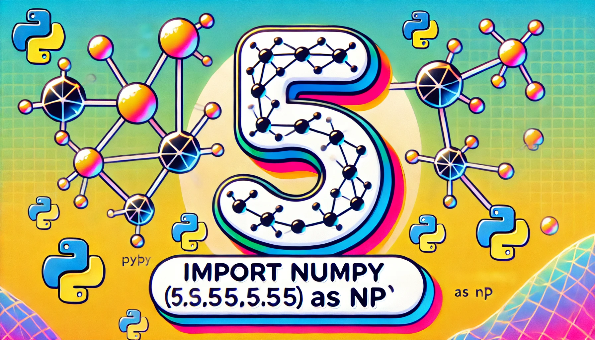

# Neural network from scratch in numpy

In this notebook I have implemented a simple NN that recognize hand-written digits. The idea is inspired by the video of [Samson Zhang](https://www.youtube.com/watch?v=w8yWXqWQYmU).

